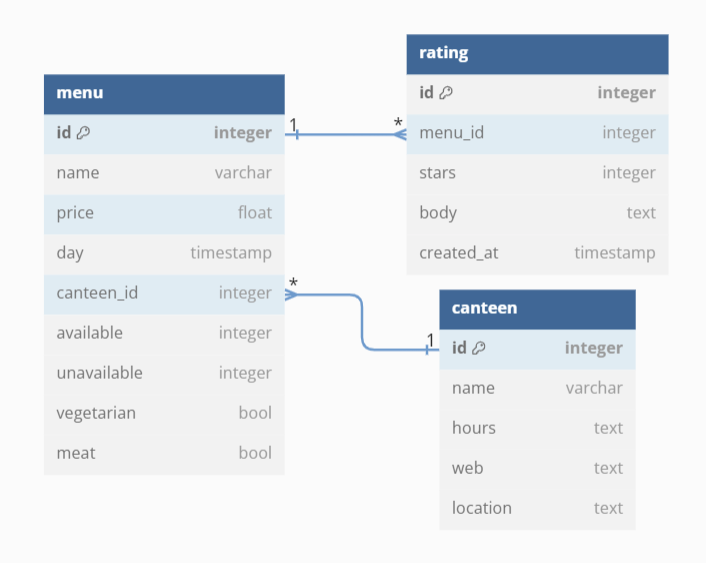

# CanteenSpy Backend
Provides API for frontend in Django, run in VM

## Virtual machine
### Setup
1. ```cd backend```
2. ```python -m venv .venv```

### Start
Windows: ```. .venv/Scripts/activate```
Linux: ```. .venv/bin/activate```

### Stop
```deactivate```

## Server
Everything must by done in Virtual Machine (.venv)
### Setup
1. ```pip install django```
2. ```pip install djangorestframework```
3. ```pip install django-cors-headers```

### Start
```python manage.py runserver```

### Stop
Pres Ctrl + C

### Apply changes
1. ```python manage.py makemigrations```
2. ```python manage.py migrate```

## Data


## API
### Canteen
```canteens```  
list all canteens
```json
{canteens: [
    {
            "id": 1,
            "name": "Eat & Meet",
            "hours": "07:00-20:30,\r\n07:00-20:30,\r\n07:00-20:30,\r\n07:00-20:30,\r\n07:00-20:30,\r\n09:00-19:00,\r\n09:00-19:00",
            "web": "http://eatandmeet.sk/",
            "location": "Átriové domky blok AD-U, Staré Grunty 36, 841 04 Bratislava-Karlova Ves"
        },
        ...
    ]
}
```

```canteens/<id>```
info about canteen with given *id*
```json
{
    "id": 1,
    "name": "Eat & Meet",
    "hours": "07:00-20:30,\r\n07:00-20:30,\r\n07:00-20:30,\r\n07:00-20:30,\r\n07:00-20:30,\r\n09:00-19:00,\r\n09:00-19:00",
    "web": "http://eatandmeet.sk/",
    "location": "Átriové domky blok AD-U, Staré Grunty 36, 841 04 Bratislava-Karlova Ves"
}
```

#### Canteen arguments
Multiple arguments can be used and joined by `&`

```canteens/?sort=[avg_rating/low_price]&desc=true``` - sort canteens by average rating or by lowest price with option order descending. Deafault is sort by closing time and order ascending.

```canteens/?filter=[available_menu/vegetarian/meat]``` - show only canteens which have today at least one menu of selected category.

### Menu
```menus/<canteen_id>/<date>```  
menus for canteen by given *canteen_id* and by given *date*  
eg. localhost:8000/menus/1/2023-12-08 GET
```json
[
    {
        "id": 31,
        "name": "Vyprážaný syr, tatarská omáčka (1,3,7)",
        "price": "3.70",
        "day": "2023-12-08",
        "available": 0,
        "unavailable": 0,
        "meat": false,
        "vegetarian": true,
        "canteen_id": 1
    },
    ...
]
```

```menus/available/<menu_id>```  
add 1 to number of available for menu with given *menu_id*

```menus/unavailable/<menu_id>```  
add 1 to number of unavailable for menu with given *menu_id*

### Rating
```ratings/<menu_id>```  
get ratings for given *menu_id*
```json
[
    {
        "id": 4,
        "menu_id": 2,
        "stars": 1,
        "body": "toto uz prosim nerobte",
        "created_at": "2023-12-04T16:23:32.933649Z"
    },
    {
        "id": 5,
        "menu_id": 2,
        "stars": 3,
        "body": "ok",
        "created_at": "2023-12-04T16:23:45.930814Z"
    }
]
```